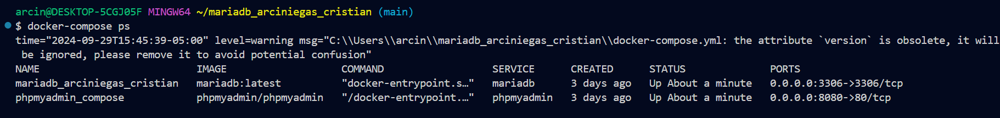
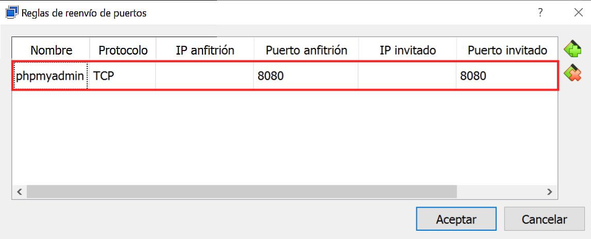
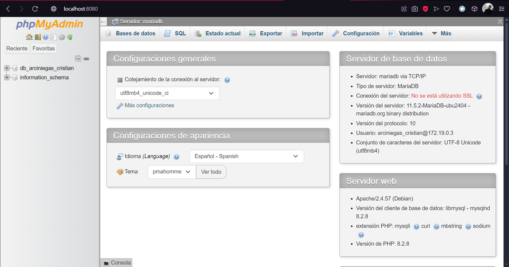

Autor: Cristian Alexander Arciniegas Silva

Objetivo: Implementar cliente phpMyadmin conectado con Base de datos MariaDb utilizando docker compose

# Configuracion del docker-compose.yml

```yml
version: '3.1'
services:
  mariadb:
    image: mariadb:latest
    container_name: mariadb_arciniegas_cristian
    environment:
      - MYSQL_ROOT_PASSWORD=${MYSQL_ROOT_PASSWORD}
      - MYSQL_DATABASE=${MYSQL_DATABASE}
      - MYSQL_USER=${MYSQL_USER}
      - MYSQL_PASSWORD=${MYSQL_PASSWORD}
    ports:
      - "3306:3306"
    volumes:
      - mariadb_data:/var/lib/mysql
    networks:
      - mariadb_network
  phpmyadmin:
    image: phpmyadmin/phpmyadmin
    container_name: phpmyadmin_compose
    ports:
      - "8080:80"
    environment:
      - PMA_HOST=mariadb
      - PMA_USER=${MYSQL_USER}
      - PMA_PASSWORD=${MYSQL_PASSWORD}
    networks:
      - mariadb_network
volumes:
  mariadb_data:
 
networks:
  mariadb_network:
```
Para definir las variables de entorno, haga una copia del archivo .env.template y asigne valores a cada una de las variables.

Para esta configuración se utilizaron las siguientes variables de entorno:

MYSQL_ROOT_PASSWORD: Define la contraseña del usuario root de la base de datos MySQL.

MYSQL_DATABASE: Especifica el nombre de la base de datos que se creará al inicializar el contenedor.

MYSQL_USER: El nombre del usuario de la base de datos.

MYSQL_PASSWORD: Contraseña para el usuario de la base de datos.

PMA_USER: El nombre de usuario que se utilizará para acceder a PhpMyAdmin.

PMA_PASSWORD: La contraseña para acceder a PhpMyAdmin.

Se configuró la red mariadb_network para conectar los servicios de MariaDB y PhpMyAdmin.

También se asignaron puertos y volúmenes para garantizar la persistencia de datos y el acceso a la base de datos desde la interfaz web de PhpMyAdmin en `localhost:8080`

# Como implementar el proyecto

Ejecute el siguiente comando para implementar los servicios.
```
docker-compose up -d
```
Verifique que los contenedores esten en ejecucion.
```
docker-compose ps
```


# Conexión con el cliente
Si esta usando virtualbox, puede configurar el reenvio de puertos de la siguiente manera:


La imagen muestra la configuración de reglas de reenvío de puertos para PhpMyAdmin:

Nombre: phpmyadmin - Identifica la regla.

Protocolo: TCP - Indica el protocolo utilizado.

Puerto anfitrión: `8080` - Se usará en el anfitrión para acceder a PhpMyAdmin.

Puerto invitado: `8080` - Donde corre PhpMyAdmin en la máquina invitada.

Esta regla redirige el tráfico del puerto 8080 en el host al puerto `8080` en la máquina invitada, facilitando el acceso a PhpMyAdmin.

# Acceder a PhpMyAdmin

Se usará la siguiente dirección para visualizar el interfaz web de PhpMyAdmin:
```
http://localhost:8080
```
En caso de que al ingresar le solicite credenciales debe ingresar las variables de entorno `PMA_USER` y `PMA_PASSWORD` que asignó en su archivo `.env` para asi ingresar a PhPhpMyAdmin.



Por ultimo, cuando pueda ingresar tiene que visualizar de esta manera PhPhpMyAdmin.