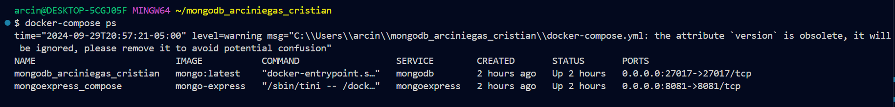

Autor: Cristian Alexander Arciniegas Silva

Objetivo: Implementar cliente Mongo Express conectado con Base de datos MongoDB utilizando docker compose.

# Configuracion del docker-compose.yml

```yml
version: '3.1'
services:
  mongodb:
    image: mongo:latest
    container_name: mongodb_arciniegas_cristian
    environment:
      - MONGO_INITDB_ROOT_USERNAME=${MONGO_INITDB_ROOT_USERNAME}
      - MONGO_INITDB_ROOT_PASSWORD=${MONGO_INITDB_ROOT_PASSWORD}
    ports:
      - "27017:27017"
    volumes:
      - mongodb_data:/data/db
    networks:
      - mongo_network

  mongoexpress:
    image: mongo-express
    container_name: mongoexpress_compose
    ports:
      - "8081:8081"
    environment:
      - ME_CONFIG_MONGODB_ADMINUSERNAME=${MONGO_INITDB_ROOT_USERNAME}
      - ME_CONFIG_MONGODB_ADMINPASSWORD=${MONGO_INITDB_ROOT_PASSWORD}
      - ME_CONFIG_MONGODB_SERVER=mongodb
      - ME_CONFIG_BASICAUTH_USERNAME=${MONGO_INITDB_ROOT_USERNAME}   
      - ME_CONFIG_BASICAUTH_PASSWORD=${MONGO_INITDB_ROOT_PASSWORD}  
    networks:
      - mongo_network

volumes:
  mongodb_data:

networks:
  mongo_network:
```
Las variables de entorno en la configuración del archivo `docker-compose.yml` son esenciales para establecer la conexión y autenticación en los servicios de `MongoDB` y `Mongo Express`. Aquí están las variables utilizadas:

`MONGO_INITDB_ROOT_USERNAME:` Esta variable define el nombre de usuario del administrador de MongoDB, permitiendo el acceso completo a la base de datos.

`MONGO_INITDB_ROOT_PASSWORD:` Especifica la contraseña del administrador de MongoDB, asegurando que solo los usuarios autorizados puedan acceder a las funciones administrativas.

`ME_CONFIG_MONGODB_ADMINUSERNAME:` Configura el nombre de usuario del administrador en la interfaz de Mongo Express, que se utiliza para autenticar la conexión a MongoDB.

`ME_CONFIG_MONGODB_ADMINPASSWORD:` Establece la contraseña del administrador para Mongo Express, asegurando que la interfaz esté protegida.

`ME_CONFIG_MONGODB_SERVER:` Indica el nombre del servicio de MongoDB al que se conectará Mongo Express, facilitando la comunicación entre ambos servicios.

`ME_CONFIG_BASICAUTH_USERNAME:` Define el nombre de usuario para la autenticación básica en Mongo Express, añadiendo una capa de seguridad adicional.

`ME_CONFIG_BASICAUTH_PASSWORD:` Especifica la contraseña para la autenticación básica, garantizando que solo usuarios con credenciales válidas puedan acceder a la interfaz.

Estas variables deben ser asignadas adecuadamente en un archivo `.env` para que la configuración funcione correctamente.

# Como implementar el proyecto

Ejecute el siguiente comando para implementar los servicios.

```
docker-compose up -d
```
Verifique que los contenedores esten en ejecucion.
```
docker-compose ps
```


# Conexión con el cliente
Si esta usando virtualbox, puede configurar el reenvio de puertos de la siguiente manera:


La imagen muestra la configuración de reglas de reenvío de puertos para Mongo Express:

Nombre: mongoexpress - Identifica la regla.

Protocolo: TCP - Indica el protocolo utilizado.

Puerto anfitrión: 8081 - Se usará en el anfitrión para acceder a Mongo Express.

Puerto invitado: 8081 - Donde corre Mongo Express en la máquina invitada.

Esta regla redirige el tráfico del puerto 8081 en el host al puerto 80801 en la máquina invitada, facilitando el acceso a Mongo Express.

# Acceder a Mongo Express
Se usará la siguiente dirección para visualizar el interfaz web de Mongo Express:
```
http://localhost:8081
```
En caso de que al ingresar le solicite credenciales debe ingresar las variables de entorno `MONGO_INITDB_ROOT_USERNAME` y `MONGO_INITDB_ROOT_PASSWORD` que asignó en su archivo `.env` para asi ingresar a Mongo Express.


Al ingresar`MONGO_INITDB_ROOT_USERNAME` y `MONGO_INITDB_ROOT_PASSWORD` debe verse de la siguiente manera.


Por ultimo, al visualizarlo de esta manera significa que ingresaste correctamente.


